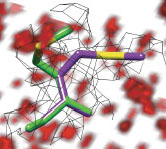

<head>
<title>END/RAPID</title>

</head>
<body>
<table width="990" border="0">
  <tr>
    <td width="200" valign="top">
	<table valign="center" align="center" border="0" width="200">
      <tr>
        <td width="226" height="147" bgcolor="#999999">

</td>
      </tr>
      <tr>
        <td height="79" bgcolor="#FF3300">
<a href="end.rapid/Documentation/end.rapid.Manual.htm#OverviewofEndRapid" class="style1">Overview of END and RAPID</a> 
</td>
      </tr>
      <tr>
        <td height="71" bgcolor="#999999">
<a href="end.rapid/Documentation/documentation.htm" class="style1">Documentation</a>
</td>
      </tr>
      <tr>
        <td height="68" bgcolor="#FF3300">
<a href="end.rapid/TestSets/testSets.htm" class="style1">Test Sets</a>
</td>
      </tr>
       <td height="74" bgcolor="#999999">
<a href="http://bl831.als.lbl.gov/ringer/ringer.htm" class="style1">Ringer</a>
</td>
       </tr>
      <tr>
        <td height="81" bgcolor="#FF3300">
<a href="https://academictree.org/chemistry/peopleinfo.php?pid=62703" class="style1">Alber Lab </a>
</td>
      </tr>
    </table>	
    </td>
    <td width="779" valign="top">
	<table width="845" valign="top" border="0">
      <tr>
        <td width="839" height="146" bordercolor="#999999" bgcolor="#999999">
END and RAPID Maps
</td>
      </tr>
    </table>
	<!-- InstanceBeginEditable name="EditRegion1" --><table width="834" height="785" border="0" >
        <tr>
          <td width="828" height="781" align="center" valign="top">
&nbsp;

            
Absolutely-scaled electron density maps for more accurate signal 
            True noise maps to help clear the fog

            
&nbsp;

          

          
&nbsp;

          <blockquote>
            <blockquote>
              <blockquote>
                <blockquote>
                  
Citing END/RAPID: Protein structural ensembles are revealed by redefining x-ray eletron density noise.&nbsp;Lang PT, Holton JM, Fraser JS, Alber T. <em>PNAS USA</em>. <b>111</b> 237-247

                </blockquote>
              </blockquote>
            </blockquote>
        </blockquote>
          
&nbsp;
</td>
        </tr>
      </table>
	  <!-- InstanceEndEditable --></td>
  </tr>
</table>
</body>
<!-- InstanceEnd --></html>

